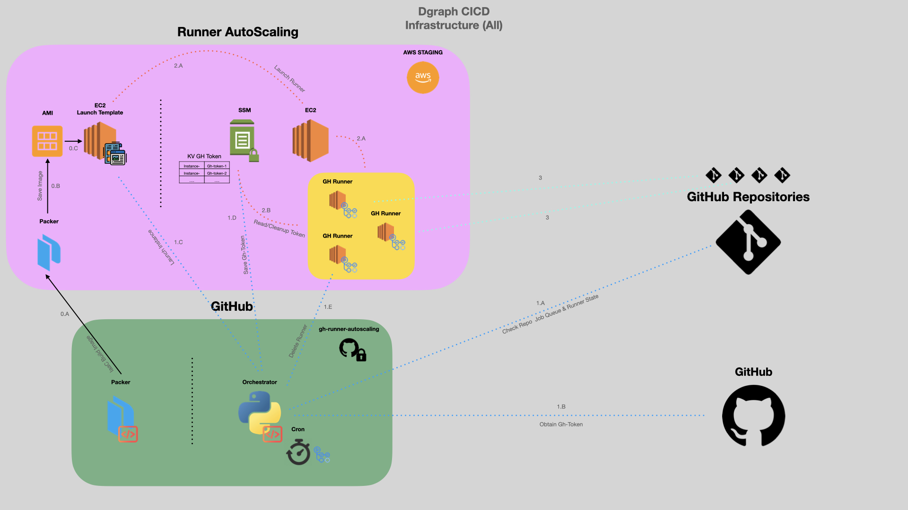

# Github Runner AutoScaling

> This is an archive of our previous autoscaling infrastructure.  This repository will not
> receive further updates.

### Architecture Diagram



### Project Overview

This repository handles auto-scaling of our VM runners for dgraph github projects. We want this mostly to reduce the 
maintenance pain points & cost. The project has 2 pieces primarily:
- Infrastructure
- Source Code 

#### Infrastructure 

We use [Packer](https://www.packer.io) to create an AWS machine image (AMI) for our EC2 self-hosted runners. This 
image contains all the dependencies `init-dependencies.sh` that we need to run a Github actions job. It will also register itself as a runner, 
which is done by `init-runner.sh` which runs when the instance comes up. In summary, every instance that is created from 
this AMI is ready to run a Github actions job without any further configurations. The configurations for packer build 
step is maintained in the respective `*.pkr.hcl` files for different architectures.

How to build the AMI?

1. [Install](https://developer.hashicorp.com/packer/tutorials/aws-get-started/get-started-install-cli) Packer on your machine
2. [Authenticate](https://developer.hashicorp.com/packer/plugins/builders/amazon#authentication) to AWS
3. Build the AMI
    ```
    packer build . 
    ```
4. Visit the [AWS AMI](https://us-east-1.console.aws.amazon.com/ec2/home?region=us-east-1#Images:visibility=owned-by-me;sort=imageName) 
page to verify that Packer successfully built your AMI.

Once the AMI is built - it's important to associate them with the Launch Template for use.

#### Source Code

The Source Code is our Orchestrator. This has 2 modes of operations `manual` & `auto`. The code is written in python and
it communicates with AWS (EC2, SSM) & GitHub. 

The idea is as follows: 
- during scale-ups - the program will obtain a token from GitHub and save it on SSM using the instance-id as the unique 
deliminator. When the instance bootsup, it reads this token & self-registers with GitHub repository.
- during scale-downs - the program will deregister the runner, and delete the instance on AWS.

Regarding the modes:
- `manual`, we can manually add or remove instances 
- `auto`, the program will run indefinitely and will manage auto-scaling for multiple repositories based on what is 
defined inside of `config.yaml`

### Operations

#### Setup
- Install Python3+
- Install Requirements (you can do it with PyEnv or Venv)
    ```
    cd src
    pip install -r requirements.txt
    ```
- Edit the `src/config.template.yaml` by replacing the templated values to create `src/config.yaml`

#### Manual
- scale-up
    ```
    export GH_OWNER="XXXXX"
    export GH_REPOSITORY="XXXXX"
    export GH_TOKEN="XXXXX"
    export AWS_ACCESS_KEY_ID="XXXXX"
    export AWS_SECRET_ACCESS_KEY="XXXXX"
    cd src
    python scale.py up -a arm64 # for arm64
    python scale.py up -a amd64 # for amd64
    ```
- scale-down
    ```
    export GH_OWNER="XXXXX"
    export GH_REPOSITORY="XXXXX"
    export GH_TOKEN="XXXXX"
    export AWS_ACCESS_KEY_ID="XXXXX"
    export AWS_SECRET_ACCESS_KEY="XXXXX"
    cd src
    python scale.py down -r i-XXXXX
    ```

#### Automatic
- automatic
    ```
    # make sure to add your repository to `config.yaml`
    export GH_TOKEN="XXXXX"
    export AWS_ACCESS_KEY_ID="XXXXX"
    export AWS_SECRET_ACCESS_KEY="XXXXX"
    cd src
    python scale.py auto
    ```
